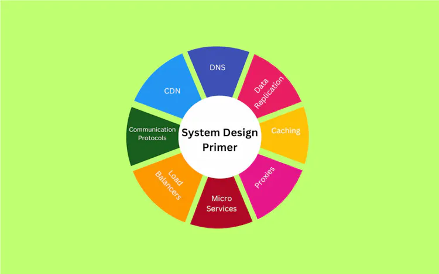

# System Design Primer: The Ultimate Guide
Dive deep into system design with our System Design Primer ultimate guide. From beginners to experienced professionals, we've got resources to elevate your skills.

***
## Understanding System Design
 ***
 **System design**  is a step-by-step process of defining a particular software's architecture, modules, components, etc. It is a base concept in software engineering and is vital in building scalable and reliable software.

Furthermore, tech giant companies like Google, Microsoft, Amazon, etc., have particular rounds for the system design interview in their interview process. In this round, they check the interviewer's ability to think about building the application's architecture from scratch.

So, it becomes essential to learn and clear all concepts of the system design. This system design primer helps you to understand the essence of system design and various concepts from basic to advanced.

## Exploring Essential Design Methods in System Design
The system design contains a wide range of design methods and techniques to design the system's architecture.They include;

### 1. Architectural Design
**The architectural design** is the base of the system design. It describes the infrastructure, model, view, components, and interaction.

The architectural design includes;
 - client-server interaction
 - microservices

### 2. ERD Diagram
**The ERD diagram** is an acronym for the entity-relationship diagram. The ERD diagram is mainly used in designing the application's database structure.

In the ERD diagram, you can                        
- Define multiple database schemas                  
- Add entities in each schema,               
- Add multiple attributes for each entity. 
- Connect the entities of two different schemas if a relationship exists between them.

### 3. UML Diagram
**The UML** stands for the unified modeling language. It is used to prepare modeling software systems.

It contains different diagrams like 
- Activity diagrams 
- Class diagrams, 
- Sequence diagrams 
To represent the different aspects of the system.

### 4. Class Diagrams
**The class diagrams** are used to represent the classes. The class diagram can also contain the;      
 - Class's attributes methods,        
 - Relationships between multiple classes.

Basically, the class diagram provides an overview of the system's data and functionality.

### 5. Sequence Diagrams
The sequence diagrams represent the interaction between the various components of the system. It is used to model the behavior of the system.

For example, you can specify when users enter the specific input at the front end side of the application, how the application should process the data, and return the response.

## Fundamental System Design Concepts

Let's look at each concept one by one.
### 1. Performance vs Scalability
**Performance:** When you visit any particular website, some website takes more time to load, and others get loaded in a fraction of a second. For example, Google.

If the loading time of your website is longer, traffic can decrease as visitors prefer to go to other websites. Various mechanisms like caching can be used to increase the application's performance and serve resources faster.

**Scalability:** The term scalability refers to the ability to scale the application. For example, your application is becoming more popular every day, and due to that, your application’s server is getting more requests
### 2. Latency vs Throughput
The latency and throughput affect the efficiency of the system.

**Latency:** The latency is a measurement of the time delay to complete a single request or data operation. The latency is mainly crucial in online or live gaming, live streaming, video calls, etc., for a seamless user experience.

It is a network delay that occurs due to; 
- Geographical distance, 
- Transport protocol
 - Network infrastructure. *It is measured in the **Milliseconds***

**Throughput:** On the other hand, throughput is the number of operations the system can handle in a particular time or the number of data passed via network request in a given time.

*It is measured in **megabytes (MB) per second***. It is used to check the capability of the systems. If the throughput of the server is low, architectures can scale the server to make it efficient.
### 3. Consistency Patterns and Availability Patterns
It is crucial to achieve consistency and availability while designing the system architecture. Let’s understand them.

**Consistency:** Consistency ensures that all nodes in the system read the same data at a particular time.

**Availability:** The system's availability ensures that each request receives a response either with fresh or old data. The availability is important when high uptime is needed.
### **Consistency Patterns**
**Strong consistency:** Strong consistency ensures that each request should get the most recent data. To achieve strong consistency, you require synchronized communication. It prioritizes consistency over availability.
**Eventual Consistency:** Eventual consistency allows temporary inconsistencies to be resolved soon. It prioritizes availability over consistency.
**Weak Consistency:** In the weak consistency pattern, the user may get fresh data after writing the data. It focuses on the fast access. It can be used in live streaming or video chat.

### Availability Patterns
**Load Balancing:** The upcoming request can be distributed across multiple servers to achieve high availability. As we balance the load here, it is called the load balancing.
**Retry and timeout** strategies: You can implement the retry mechanism to process the request after every interval if the system fails or is not available. For example, if you didn’t get a response on any website, you may refresh it and get a response.
Advanced Concepts in System Design
## Advanced concepts of the system design.

### 1. CDN
**CDN** stands for the content delivery network. The CDN is a distributed server network located at different geo-locations. The CDN is used to deliver content like images, various data, etc., from the server.

The CDN 
- Delivers the resource faster 
- Decreases latency (network delay) 
- Improves the application's performance.

When users request a particular resource, the application requests the nearest server. If the nearest server has cached resources already, it serves it directly. Otherwise, it requests the origin server, caches the resources, and delivers them to the users. Next time, when the server gets a request for the same resource, it will return the cached resources.

### 2. DNS
**The DNS** stands for the domain name system. The DNS system allows users to access the website and its resources using the domain name (e.g., www.example.com). It maps the unique domain name with a unique IP address. So, whenever you make a request for the resources of the particular domain name, it returns the resources of IP addresses, which are mapped with the domain name.

### 3. Caching
Caching is a mechanism to serve resources faster. It is also called high-speed storage. It works between the web application and the source of the data.

For example, when you make a request for some data, the application checks first in the cache storage. If data exists in the cache storage, it returns the data. Otherwise, it requests the database or source of the data, stores it in the cache storage, and sends data to the application.
### 4. Proxies/Proxy server
The proxy server works between the client of the application and the internet. Whenever you request to get resources from the internet, the application requests the proxy server, and the proxy server gets resources and sends them back to the application.

The proxy servers are used for the caching
***
***
## Components of System Design
 The components of the system design 

## 1. Microservices and Service Discovery
Microservices architecture is one of the most used system design approaches to prepare software architecture. The microservices break down complex applications into small services, such that each service works independently and accomplishes specific tasks.

The concepts below are related to the microservices.

**Service Identification:** Every microservice has a unique ID and name for its identification.
**Dynamic Service Discovery:** Each microservice can dynamically find other services located in the same network. So, scaling and load balancing become easy.
2. Database Systems: RDBMS and NoSQL
. There are two primary categories of the database:
 1.RDBMS  2.NoSQL.

### RDBMS
**The RDBMS** stands for the relational database management system. The SQL databases are built on the top of the RDBMS. When you need to store structured data, you can choose the RDBMS for the software or application. It makes it easier to access the data from the database and connect it with other data as they are stored in the table format.

Here are the characteristics of the RDBMS database.

It stores the data in the table format.
You can’t scale the RDBMS database horizontally, but you can scale it vertically.
SQL is a query language for the RDBMS databases.
Accessing data from the RDBMS database is slow.
NoSQL
The NoSQL database means a non-SQL database. It stores the data in the key-value pair instead of in table format. You can use the NoSQL database when you are required to store unstructured data in the database.

 #### Characteristics of the NoSQL database.

- It stores the data in the key-value pair format.
- NoSQL database is horizontally scalable, as you can add new key-value pairs for new attributes.
- Each record can contain different key-value pairs.
- It is faster than RDBMS databases.
- It supports frequent changes in the database.
## 3. Communication Protocols
**Protocols** mean rules and communication protocols refer to the rules to communicate or exchange the data between two systems. The systems can also be server and client.

Here, I’ve explained various communication protocols.

**HTTP/HTTPS:** The full form of the HTTP is a hypertext transfer protocol. HTTPS is a secure version of HTTP. They are used in web-based communication. It is a good idea to use HTTPS always for security reasons.
**TCP/IP:** The TCP stands for the transmission control protocol. The TCP protocol is used to communicate over the internet. For example, it is used in the chatting application.
**UDP** – The UDP is an acronym for the user datagram protocol. It is mainly used for live streaming, video calls, etc., in which data loss can be tolerable.
**WebSockets:** The web sockets are used for bi-directional duplex communication. It builds the connection between two web applications.**
***
***
## Approaching System Design Interview Questions

### Step-by-step Guide
### 1. Requirements clarification
First understand the system requirements

There can be **two types** of requirements: 

**Function requirements:** they are the requirements in the application with which the user interacts. For example, authentication, navigation, payment services integration, etc.

**Non-function requirements:** They are the requirements to improve the application's capabilities. For example, high availability, scalability, consistency, low latency, high throughput, etc., are the non-functional requirements.
### 2. Estimation of resources
yo need to decide what kind of resources you should use to build the application.

### 3. System interface definition
The third step is designing the system interface. For example, defining the API endpoints and what to expect from each API endpoint.

### 4. Defining Data model
This involves  selecting a database for the application.

 To store data use;
   - **Relational database**.For storing structured data and tables.
   - **NoSQL databases like MongoDB**.For storing the unstructured data

 **Graph databases** to manage many-to-many relationships.especially If you are building social media applications like Facebook or Twitter.

### 5. High-level design
Involve  designing the high-level components.

In this step, you need to decide how you will connect the components of the system with each other.

you can fulfill the functional requirements of the application.

### 6. Detailed design
 You need to analyze the system to fulfill the *non-functional requirements.*

You can analyze it as given below.

- How to use caching to improve the performance of the application?
- How do we scale the application via load balancing?
- Should you use the CDN for caching, or are cookies enough?
- How would you handle the failure of the application?
- Should you distribute the data across multiple databases?
- How will you replicate the database?
### 7. Identifying and resolving bottlenecks
Identify the bottlenecks in your system design and discuss the solutions to resolve them with the interviewer.

**The sample bottlenecks can be shown below**.

- Can the system fail in any scenario? If yes, how will you handle it?
- How do you monitor the performance of the system and issues in the system?
- Do you have enough replicas of the database to handle the failure?
## Sample System Design Interview Questions and Solutions

### 1. **How would you design a URL Shortening service similar to TinyURL?**
The URL shortening service allows users to shorten the long URLs. So users can use the short URL instead of the long URL, and the fun fact is that the short URL works the same as the long URL.

**Requirements clarification:**

- When you give a long URL as an input, it should return the shortened URL.
- When you click the shortened URL, it should redirect to the original URL.
- Consider 500 requests per second, and make scalable accordingly.
- Delete the expired URLs.
- Track the number of clicks on the URL.
**Approach:**
Consider the following

- How you will use the REST API to communicate with the server.
- How will you handle the 500 requests every second via load balancing?
- You can discuss using the relational database, as it doesn’t require horizontal scaling.
- You can discuss how you will prepare a table for relational database to map long URLs with short URLs.
- *The critical point is how to shorten the long URL* by providing a unique id to each shortened URL.
### 2. How would you design a Web Crawler?
**The Web crawlers** allow to extract the information from different web pages.

**Approach:**

consider
- how you open multiple web pages in the web browser.
- How many browser windows you will open simultaneously to crawl multiple web pages. Let’s say if you allow us to open 1000 browser windows together, the device may run out of memory.

- How to change the web pages and domains dynamically.

### 3. How would you design Facebook and Instagram?
Here, you are required to build a social media application.

**Requirements:**
- User signup/sign-in
- Allowing users to publish posts and short videos
- Followers and following features
- Direct messaging
- Showing the latest posts from their followers
- Showing trending posts in the feed
**Approach:**

Talk about
 - How you will handle the relationship between users in the database.

 - How you will implement the chat features. You may talk about integrating third-party chatting applications.

 - How you will implement the authentication.

- Algorithms to show trending or latest posts. 
 
 - Handling user’s data in the database, as users will publish multiple posts.
-  Database replication to handle failures.
  
- Data caching and load balancing.
### 4. How would you design the API rate limit?
**The API rate limiter **allows one to make a particular number of API requests in a specified time. If the API request increases, it blocks the request for some time.

**Approach:**

Talk about
 - *Rate-limit matrics*. How many maximum requests do you want to allow per second?
 - How you will handle multiple requests simultaneously.
 - How you can keep count of requests. You may use the IP address received in the request header.
